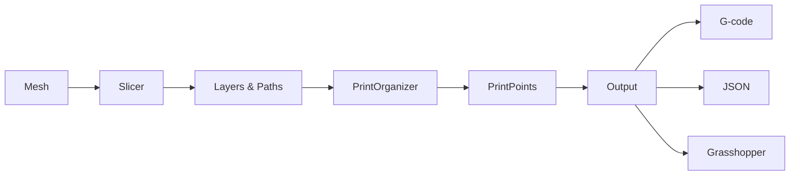

# Architecture

This page explains the core architecture of COMPAS Slicer - how data flows from mesh to G-code, and how the main components interact.

## The Slicing Pipeline

Every slicing workflow follows this pipeline:



Each stage transforms the data:

| Stage | Input | Output | Purpose |
|-------|-------|--------|---------|
| **Slicer** | Mesh | Layers containing Paths | Intersect mesh with cutting surfaces |
| **PrintOrganizer** | Layers/Paths | PrintPoints | Add fabrication parameters |
| **Output** | PrintPoints | G-code/JSON | Export for machines or visualization |

## Core Data Structures

### Hierarchy

The geometric data is organized hierarchically:

```
Slicer
└── layers: list[Layer]
    └── paths: list[Path]
        └── points: list[Point]
```

After print organization:

```
PrintPointsCollection
└── data: dict[layer_key][path_key] = list[PrintPoint]
```

### Layer

A `Layer` represents one "slice" of the model. In planar slicing, all points share the same Z height. In non-planar slicing (curved, scalar field), points can vary in height.

```python
from compas_slicer.geometry import Layer

layer = Layer(paths=[path1, path2])
layer.is_closed  # True if all paths are closed contours
```

**Key attributes:**

- `paths` - List of Path objects in this layer
- `is_raft` - Whether this is a raft layer (special handling)

### Path

A `Path` is a single contour - either closed (loop) or open (line). A layer can have multiple paths when:

- The slice intersects multiple disconnected regions
- The model has holes (inner and outer contours)

```python
from compas_slicer.geometry import Path

path = Path(points=[pt1, pt2, pt3], is_closed=True)
len(path)  # Number of points
```

**Key attributes:**

- `points` - List of COMPAS Point objects
- `is_closed` - Whether the path forms a closed loop

### PrintPoint

A `PrintPoint` extends a geometric point with all the information needed for fabrication:

```python
from compas_slicer.geometry import PrintPoint

pp = PrintPoint(
    pt=Point(0, 0, 10),
    layer_height=0.4,
    mesh_normal=Vector(0, 0, 1)
)

# Fabrication parameters (set by PrintOrganizer)
pp.velocity = 30.0          # mm/s
pp.extruder_toggle = True   # extrusion on/off
pp.wait_time = 0.0          # pause at point
```

**Key attributes:**

| Attribute | Type | Description |
|-----------|------|-------------|
| `pt` | Point | XYZ position |
| `layer_height` | float | Layer height at this point |
| `mesh_normal` | Vector | Surface normal from mesh |
| `up_vector` | Vector | Tool orientation (Z-axis of tool frame) |
| `frame` | Frame | Full tool frame for robotic fabrication |
| `velocity` | float | Travel/print speed in mm/s |
| `extruder_toggle` | bool | Whether extruder is on |
| `wait_time` | float | Pause duration in seconds |

## Slicers

All slicers inherit from `BaseSlicer` and implement `generate_paths()`:

```python
class BaseSlicer:
    def __init__(self, mesh: Mesh):
        self.mesh = mesh
        self.layers: list[Layer] = []

    def generate_paths(self) -> None:
        """Override in subclass to generate self.layers"""
        raise NotImplementedError
```

### Available Slicers

| Slicer | Algorithm | Use Case |
|--------|-----------|----------|
| `PlanarSlicer` | Horizontal plane intersection via CGAL | Standard FDM printing |
| `InterpolationSlicer` | Geodesic interpolation between boundaries | Curved shells, domes |
| `ScalarFieldSlicer` | Isocurves of scalar field on mesh | Custom layer patterns |
| `UVSlicer` | UV parameterization contours | Developable surfaces |

## Print Organization

The `PrintOrganizer` converts geometric paths to fabrication-ready `PrintPoints`:

```python
from compas_slicer.print_organization import PlanarPrintOrganizer

# Create organizer from slicer
organizer = PlanarPrintOrganizer(slicer)
organizer.create_printpoints()

# Access printpoints
for layer_key in organizer.printpoints_dict:
    for path_key in organizer.printpoints_dict[layer_key]:
        printpoints = organizer.printpoints_dict[layer_key][path_key]
```

### Post-Processing Functions

After creating printpoints, apply fabrication parameters:

```python
from compas_slicer.print_organization import (
    set_linear_velocity_constant,
    set_extruder_toggle,
    add_safety_printpoints,
)

# Set constant velocity
set_linear_velocity_constant(organizer, velocity=25.0)

# Set extrusion on/off based on path structure
set_extruder_toggle(organizer, slicer)

# Add safety moves between layers
add_safety_printpoints(organizer, z_hop=10.0)
```

## Data Flow Example

Here's the complete flow for planar slicing:

```python
from compas.datastructures import Mesh
from compas_slicer.slicers import PlanarSlicer
from compas_slicer.print_organization import PlanarPrintOrganizer
from compas_slicer.print_organization import (
    set_linear_velocity_constant,
    set_extruder_toggle,
)

# 1. Load mesh
mesh = Mesh.from_obj("model.obj")

# 2. Slice mesh into layers
slicer = PlanarSlicer(mesh, layer_height=0.4)
slicer.generate_paths()
# Result: slicer.layers = [Layer, Layer, ...]

# 3. Create printpoints with fabrication data
organizer = PlanarPrintOrganizer(slicer)
organizer.create_printpoints()
# Result: organizer.printpoints_dict[layer][path] = [PrintPoint, ...]

# 4. Set fabrication parameters
set_linear_velocity_constant(organizer, velocity=30.0)
set_extruder_toggle(organizer, slicer)

# 5. Export
organizer.printpoints_collection.to_json("output.json")
```

## Module Organization

```
compas_slicer/
├── geometry/           # Layer, Path, PrintPoint, PrintPointsCollection
├── slicers/            # BaseSlicer, PlanarSlicer, InterpolationSlicer, etc.
├── print_organization/ # PrintOrganizers and parameter functions
├── pre_processing/     # Mesh prep: move_mesh_to_point, get_distance_of_pt_from_mesh
├── post_processing/    # Path mods: simplify_paths_rdp, sort_paths, generate_brim
└── utilities/          # I/O, geometry helpers
```

## Next Steps

- [Slicing Algorithms](slicing-algorithms.md) - Deep dive into how each slicer works
- [Print Organization](print-organization.md) - Fabrication parameter details
- [Examples](../examples/index.md) - Complete working code
