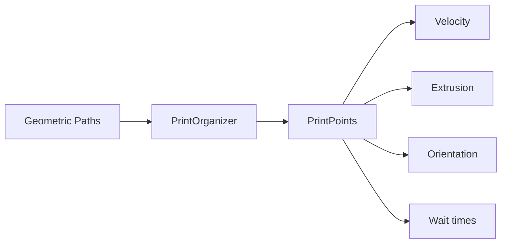

# Print Organization

This page explains how geometric paths are transformed into fabrication-ready toolpaths with all the parameters needed for 3D printing or robotic fabrication.

## Overview

After slicing, you have *geometric* data - points forming contours. Print organization adds *fabrication* data:



## The PrintOrganizer

Each slicer type has a corresponding PrintOrganizer:

| Slicer | PrintOrganizer |
|--------|----------------|
| `PlanarSlicer` | `PlanarPrintOrganizer` |
| `InterpolationSlicer` | `InterpolationPrintOrganizer` |
| `ScalarFieldSlicer` | `ScalarFieldPrintOrganizer` |

### Basic Usage

```python
from compas_slicer.slicers import PlanarSlicer
from compas_slicer.print_organization import PlanarPrintOrganizer

# 1. Slice the mesh
slicer = PlanarSlicer(mesh, layer_height=0.4)
slicer.generate_paths()

# 2. Create print organizer
organizer = PlanarPrintOrganizer(slicer)
organizer.create_printpoints()

# 3. Access printpoints
for layer in organizer.printpoints:
    for path in layer:
        for printpoint in path:
            print(printpoint.pt, printpoint.velocity)
```

### What `create_printpoints()` Does

1. **Creates PrintPoint** for each path point
2. **Computes layer height** at each point (from mesh or constant)
3. **Computes mesh normal** via raycasting to mesh surface
4. **Computes up-vector** orthogonal to path direction
5. **Builds frame** for robotic fabrication (position + orientation)

## PrintPoint Attributes

A `PrintPoint` contains everything needed for fabrication:

### Geometric

| Attribute | Type | Description |
|-----------|------|-------------|
| `pt` | Point | XYZ position |
| `layer_height` | float | Layer height at this point (mm) |
| `mesh_normal` | Vector | Surface normal from mesh |

### Orientation

| Attribute | Type | Description |
|-----------|------|-------------|
| `up_vector` | Vector | Tool Z-axis direction |
| `frame` | Frame | Full 6DOF frame for robots |

### Fabrication

| Attribute | Type | Description |
|-----------|------|-------------|
| `velocity` | float | Travel speed (mm/s) |
| `extruder_toggle` | bool | Extrusion on/off |
| `wait_time` | float | Pause duration (seconds) |
| `blend_radius` | float | Blend radius for robot motion |

### Custom Attributes

Additional attributes can be stored in `printpoint.attributes`:

```python
printpoint.attributes['temperature'] = 210
printpoint.attributes['fan_speed'] = 100
```

## Fabrication Parameters

After creating printpoints, apply fabrication parameters using utility functions.

### Velocity

```python
from compas_slicer.print_organization import (
    set_linear_velocity_constant,
    set_linear_velocity_per_layer,
    set_linear_velocity_by_overhang,
)

# Constant velocity
set_linear_velocity_constant(organizer, v=30.0)  # mm/s

# Different velocity per layer (e.g., slower first layer)
velocities = [15.0] + [30.0] * (organizer.number_of_layers - 1)
set_linear_velocity_per_layer(organizer, velocities)

# Velocity based on overhang angle
set_linear_velocity_by_overhang(
    organizer,
    overhang_range=(0.0, 0.5),   # 0° to 45° overhang
    velocity_range=(30.0, 15.0),  # slow down on overhangs
)
```

### Extrusion Toggle

Control when the extruder is on/off:

```python
from compas_slicer.print_organization import set_extruder_toggle

# Based on path structure (travel moves vs print moves)
set_extruder_toggle(organizer, slicer)
```

This sets:
- `extruder_toggle = True` for printing segments
- `extruder_toggle = False` for travel moves between paths

### Safety Points

Add Z-hop movements between layers/paths to avoid collisions:

```python
from compas_slicer.print_organization import add_safety_printpoints

add_safety_printpoints(
    organizer,
    z_hop=10.0,        # mm to lift between paths
    retract=True,      # retract filament during travel
)
```

This inserts additional printpoints:
1. Lift up from end of current path
2. Travel to start of next path
3. Lower down to begin printing

### Wait Time

Add pauses at specific points (e.g., for cooling):

```python
from compas_slicer.print_organization import set_wait_time_on_sharp_corners

set_wait_time_on_sharp_corners(
    organizer,
    threshold_angle=45.0,  # degrees
    wait_time=0.5,         # seconds
)
```

### Blend Radius (Robotic)

For robotic fabrication, set blend radius for smooth motion:

```python
from compas_slicer.print_organization import set_blend_radius

set_blend_radius(
    organizer,
    blend_radius=5.0,  # mm
)
```

## Data Smoothing

Smooth attributes across printpoints to avoid abrupt changes:

```python
from compas_slicer.print_organization import smooth_printpoints_attribute

# Smooth velocity values
smooth_printpoints_attribute(
    organizer,
    attr_name='velocity',
    iterations=3,
    strength=0.5,
)
```

## Tool Orientation

### Up Vector Computation

The up-vector determines tool orientation. For planar slicing:

```
        up_vector (Z)
            ↑
            |
     ←------●-----→ path direction
            |
        normal (from mesh)
```

The up-vector is computed as: `up = normalize(normal × path_direction)`

### Frame Construction

For robotic fabrication, a full Frame is constructed:

```python
from compas.geometry import Frame

# At each printpoint:
frame = Frame(
    point=printpoint.pt,
    xaxis=path_direction,
    yaxis=up_vector
)
# Z-axis (tool direction) is computed automatically
```

## Output Formats

### G-code

For desktop 3D printers:

```python
from compas_slicer.config import GcodeConfig

config = GcodeConfig(
    nozzle_diameter=0.4,
    filament_diameter=1.75,
    print_speed=30,
    travel_speed=120,
)

gcode = organizer.output_gcode(config)
with open("output.gcode", "w") as f:
    f.write(gcode)
```

### JSON

For custom post-processing or visualization:

```python
import json

# Flat structure
data = organizer.output_printpoints_dict()
with open("printpoints.json", "w") as f:
    json.dump(data, f)

# Nested structure (layer > path > printpoint)
nested_data = organizer.output_nested_printpoints_dict()
```

### Grasshopper

Export for visualization in Rhino/Grasshopper:

```python
organizer.printpoints.to_json("printpoints.json")
# Load in Grasshopper with csLoadPrintpoints component
```

## Complete Example

```python
from pathlib import Path
from compas.datastructures import Mesh
from compas_slicer.slicers import PlanarSlicer
from compas_slicer.print_organization import (
    PlanarPrintOrganizer,
    set_linear_velocity_constant,
    set_extruder_toggle,
    add_safety_printpoints,
)
from compas_slicer.config import GcodeConfig

# Load mesh
mesh = Mesh.from_obj(Path("model.obj"))

# Slice
slicer = PlanarSlicer(mesh, layer_height=0.3)
slicer.generate_paths()

# Create printpoints
organizer = PlanarPrintOrganizer(slicer)
organizer.create_printpoints()

# Set fabrication parameters
set_linear_velocity_constant(organizer, v=30.0)
set_extruder_toggle(organizer, slicer)
add_safety_printpoints(organizer, z_hop=5.0)

# Print summary
organizer.printout_info()
# Output:
# Number of layers: 250
# Number of paths: 250
# Number of PrintPoints: 45000
# Toolpath length: 12500 mm
# Total print time: 0 hours, 15 minutes, 30 seconds

# Export G-code
gcode = organizer.output_gcode(GcodeConfig())
Path("output.gcode").write_text(gcode)
```

## Available Functions

### Velocity

| Function | Description |
|----------|-------------|
| `set_linear_velocity_constant` | Same velocity everywhere |
| `set_linear_velocity_per_layer` | Different velocity per layer |
| `set_linear_velocity_by_range` | Velocity based on any parameter |
| `set_linear_velocity_by_overhang` | Velocity based on overhang angle |

### Extrusion

| Function | Description |
|----------|-------------|
| `set_extruder_toggle` | On/off based on path structure |

### Safety

| Function | Description |
|----------|-------------|
| `add_safety_printpoints` | Z-hop between paths |

### Timing

| Function | Description |
|----------|-------------|
| `set_wait_time_on_sharp_corners` | Pause at sharp corners |

### Smoothing

| Function | Description |
|----------|-------------|
| `smooth_printpoints_attribute` | Smooth any attribute |
| `smooth_printpoints_layer_height` | Smooth layer heights |

### Robotic

| Function | Description |
|----------|-------------|
| `set_blend_radius` | Robot motion blending |

## Next Steps

- [Architecture](architecture.md) - Data structures overview
- [Slicing Algorithms](slicing-algorithms.md) - How slicers work
- [G-code Example](../examples/04_gcode.md) - Complete G-code workflow
