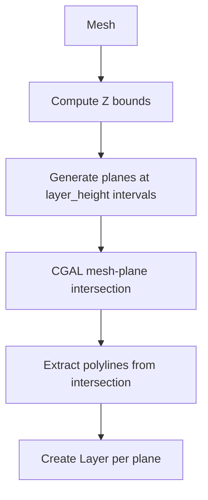
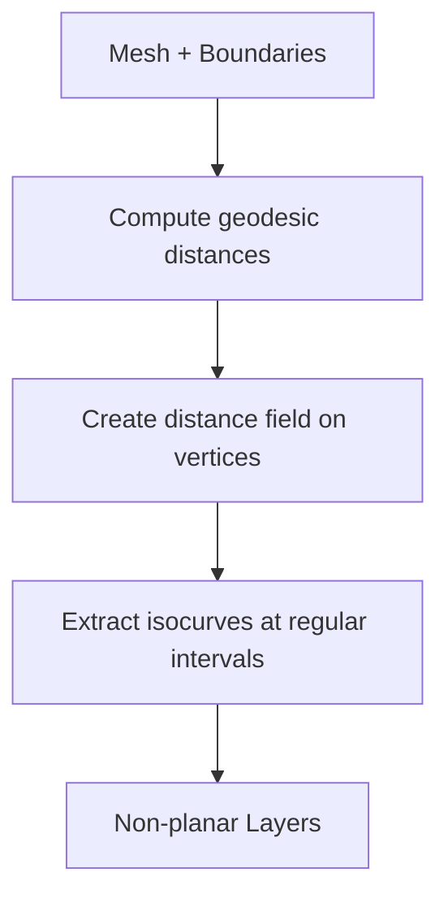
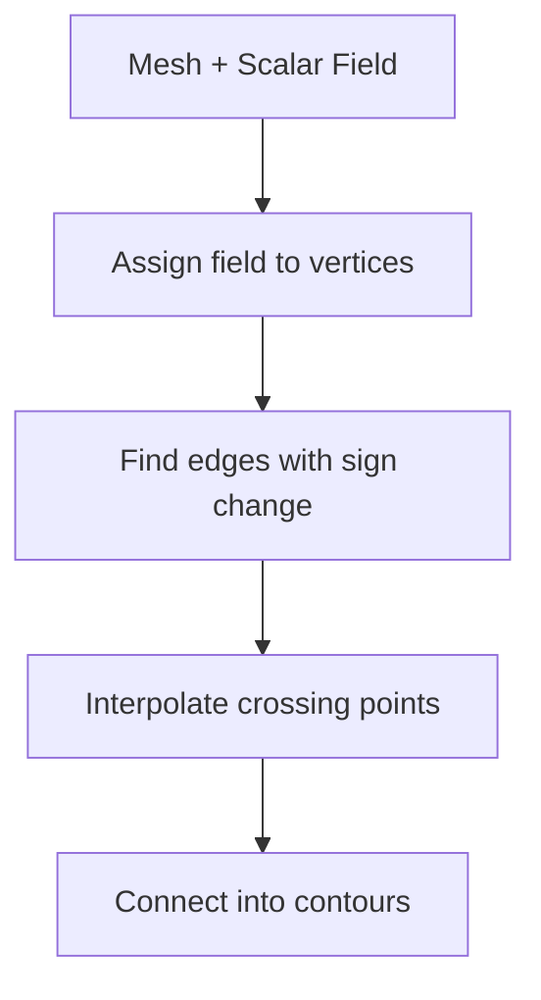
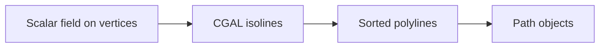

# Slicing Algorithms

This page explains how each slicing algorithm works under the hood.

## Overview

All slicers share a common pattern:

1. **Input**: A triangulated mesh
2. **Process**: Generate cutting surfaces and find intersections
3. **Output**: Layers containing Paths (contours)

The key difference is *what cutting surfaces* are used:

| Slicer | Cutting Surface | Result |
|--------|-----------------|--------|
| `PlanarSlicer` | Horizontal planes at fixed Z heights | Parallel horizontal contours |
| `InterpolationSlicer` | Isosurfaces of geodesic distance field | Contours that follow mesh curvature |
| `ScalarFieldSlicer` | Isosurfaces of user-defined scalar field | Custom contour patterns |

## Planar Slicing

### Algorithm

The simplest approach - intersect the mesh with horizontal planes:



### How It Works

1. **Compute bounds**: Find min/max Z coordinates of mesh vertices
2. **Generate planes**: Create horizontal planes from `z_min` to `z_max` spaced by `layer_height`
3. **Intersect**: Use CGAL's `slicer()` function for robust mesh-plane intersection
4. **Extract contours**: CGAL returns polylines for each connected intersection

```python
from compas_slicer.slicers import PlanarSlicer

slicer = PlanarSlicer(mesh, layer_height=0.4)
slicer.generate_paths()

# Result: slicer.layers contains one Layer per plane
# Each Layer contains one or more Paths (contours)
```

### Why CGAL?

CGAL (Computational Geometry Algorithms Library) provides:

- **Robustness**: Handles degenerate cases (edges exactly on plane, etc.)
- **Speed**: Optimized C++ implementation
- **Correctness**: Proper handling of mesh topology

The intersection is computed via `compas_cgal.slicer.slice_mesh()`.

### Parameters

| Parameter | Type | Description |
|-----------|------|-------------|
| `layer_height` | float | Distance between planes in mm |
| `slice_height_range` | tuple | Optional (z_start, z_end) to slice only part of mesh |

## Interpolation Slicing (Curved Slicing)

### Concept

Instead of horizontal planes, generate contours that *interpolate between two boundary curves*. This creates non-planar toolpaths that follow the mesh surface.



### How It Works

1. **Define boundaries**: Mark two sets of mesh vertices as `target_LOW` and `target_HIGH`
2. **Compute distances**: Calculate geodesic distance from each vertex to both boundaries
3. **Interpolate**: For each vertex, compute interpolated distance: `d = t * d_low + (1-t) * d_high`
4. **Extract isocurves**: Find contours where the interpolated field equals zero

The key insight: by varying `t` from 0 to 1, the zero-isocurve sweeps from one boundary to the other.

```python
from compas_slicer.slicers import InterpolationSlicer
from compas_slicer.pre_processing import InterpolationSlicingPreprocessor

# 1. Define boundaries
preprocessor = InterpolationSlicingPreprocessor(mesh, ...)
preprocessor.create_compound_targets()

# 2. Slice with interpolation
slicer = InterpolationSlicer(mesh, preprocessor)
slicer.generate_paths()
```

### Mathematical Background

For a mesh with vertices $V$, we compute:

- $d_{low}(v)$ = geodesic distance from vertex $v$ to lower boundary
- $d_{high}(v)$ = geodesic distance from vertex $v$ to upper boundary

The interpolated field at parameter $t \in [0, 1]$:

$$f_t(v) = (1-t) \cdot d_{low}(v) - t \cdot d_{high}(v)$$

The zero-level set $\{v : f_t(v) = 0\}$ gives one contour. Varying $t$ generates all contours.

### Use Cases

- **Domes and shells**: Toolpaths follow curvature for better adhesion
- **Overhangs**: Reduce support by printing along surface
- **Aesthetic parts**: Visible layer lines follow form

## Scalar Field Slicing

### Concept

The most general approach - extract isocurves of *any* scalar field defined on mesh vertices.



### How It Works

1. **Define scalar field**: Assign one float value per vertex
2. **Find zero crossings**: For each edge, check if field changes sign
3. **Interpolate position**: Find exact crossing point via linear interpolation
4. **Build contours**: Connect crossing points around faces to form polylines

```python
from compas_slicer.slicers import ScalarFieldSlicer

# scalar_field: one value per vertex
slicer = ScalarFieldSlicer(mesh, scalar_field, no_of_isocurves=50)
slicer.generate_paths()
```

### Zero-Crossing Algorithm

For an edge with vertices $(u, v)$ and field values $(f_u, f_v)$:

1. **Test**: Edge is crossed if $f_u \cdot f_v \leq 0$ (different signs)
2. **Interpolate**: Crossing point at parameter $t = \frac{|f_u|}{|f_u| + |f_v|}$
3. **Position**: $p = (1-t) \cdot p_u + t \cdot p_v$

```
     f_u = -2          f_v = +3
       u ●─────────────● v
              ↑
         crossing at t = 2/5
```

### Marching Algorithm

To build connected contours:

1. Start at any crossed edge
2. Find the face containing this edge
3. Find the other crossed edge in this face
4. Move to adjacent face sharing that edge
5. Repeat until returning to start (closed) or reaching boundary (open)

### Use Cases

- **Custom layer patterns**: Any scalar field you can compute
- **Distance-based**: Contours equidistant from a feature
- **Curvature-based**: Highlight geometric features
- **Stress fields**: From FEA analysis

## Contour Assembly

All slicers produce contours via `ScalarFieldContours`, which uses CGAL's isoline extraction:



The CGAL backend (`compas_cgal.isolines`) handles:

- **Edge crossing detection**: Finding zero-crossings on mesh edges
- **Polyline assembly**: Connecting crossings into coherent curves
- **Multiple contours**: Holes, disconnected regions, branching
- **Open/closed detection**: Identifying boundary-hitting paths

## Performance Considerations

### Planar Slicing

- **Fast**: Single CGAL call handles all planes
- **Scales well**: O(n) in number of faces
- **Memory efficient**: Processes planes in batch

### Interpolation/Scalar Field Slicing

- **Slower**: One contour extraction per isocurve
- **Preprocessing cost**: Geodesic distance computation
- **Mesh quality matters**: Irregular tessellation → irregular contours

### Optimization Tips

1. **Clean mesh**: Remove degenerate faces, weld vertices
2. **Appropriate resolution**: More faces ≠ better results
3. **Layer height**: Fewer layers = faster slicing

## Comparison Summary

| Aspect | Planar | Interpolation | Scalar Field |
|--------|--------|---------------|--------------|
| **Speed** | Fast | Medium | Medium |
| **Setup** | Simple | Requires boundaries | Requires field |
| **Paths** | Horizontal only | Follow surface | Arbitrary |
| **Use case** | Standard FDM | Shells, domes | Custom patterns |

## Next Steps

- [Architecture](architecture.md) - Data structures overview
- [Print Organization](print-organization.md) - Adding fabrication parameters
- [Examples](../examples/index.md) - Complete working code
