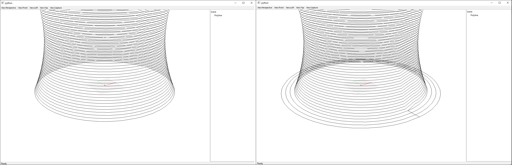

****************************
Simple planar slicing
****************************

This example describes the planar slicing process for a simple shape, consisting
out of a shape with a single contour (also known as a 'vase').

Imports and initialization
==========================

The first step is to import the required functions:

.. code-block:: python

    import time
    import os
    import logging

    import compas_slicer.utilities as utils
    from compas_slicer.pre_processing import move_mesh_to_point
    from compas_slicer.slicers import PlanarSlicer
    from compas_slicer.post_processing import generate_brim
    from compas_slicer.post_processing import simplify_paths_rdp
    from compas_slicer.post_processing import seams_smooth
    from compas_slicer.print_organization import PlanarPrintOrganizer
    from compas_slicer.print_organization import set_extruder_toggle
    from compas_slicer.print_organization import add_safety_printpoints
    from compas_slicer.print_organization import set_linear_velocity
    from compas_slicer.print_organization import set_blend_radius
    from compas_slicer.utilities import save_to_json
    from compas_viewers.objectviewer import ObjectViewer

    from compas.datastructures import Mesh
    from compas.geometry import Point

Then we initiate logging to make sure that messages generated by compas_slicer are
printed in the terminal.

.. code-block:: python

    logger = logging.getLogger('logger')
    logging.basicConfig(format='%(levelname)s-%(message)s', level=logging.INFO)

Next we point to the data folder. Compas_slicer assumed there is a folder named ``data``
where it looks for the model to slice. The model to slice can be of type ``.stl`` or ``.obj``.
Also, we want to have a folder called ``output``, where all of the output of our slicing 
process can be stored. Therefore, we run the command ``get_output_directory(DATA)``, which 
checks if the ``output`` folder exists and if not, it creates it. 

.. code-block:: python

    DATA = os.path.join(os.path.dirname(__file__), 'data')
    OUTPUT_DIR = utils.get_output_directory(DATA)
    MODEL = 'simple_vase_open_low_res.obj'

Slicing process
===============

In the next step we use the Compas function ``Mesh.from_obj`` to load our ``.obj`` 
file. We then move it to the origin, but this can be any specified point, such as 
a point on your printbed. 

.. code-block:: python

    compas_mesh = Mesh.from_obj(os.path.join(DATA, MODEL))
    move_mesh_to_point(compas_mesh, Point(0, 0, 0))

We then initialize the :class:`PlanarSlicer` to initialize the slicing process.
The layer height needs to be specified by the user. Furthermore, the ``slicing_type``
can be changed to use different methods of generating the 'slices'. Currently,
three methods for slicing are supported:

* ``default``: Uses only standard compas functions, without external libraries, but can be a bit slow.
* ``cgal``: Uses the 'compas_cgal' package, this is a very fast method but requires you to install compas_cgal.

The three methods will all return the slices of your model, so it is up to you 
to choose the method that you prefer. 

.. code-block:: python

    slicer = PlanarSlicer(compas_mesh, slicer_type="cgal", layer_height=1.5)
    slicer.slice_model()

After the model has been sliced, several post processing operations can be executed.
One useful functionality is ``generate_brim``, which generates a number of layers
that are offset from the bottom layer, to improve adhesion to the build plate 
(see image).

    *Left: Without brim. Right: With brim*

.. code-block:: python

    generate_brim(slicer, layer_width=3.0, number_of_brim_offsets=4)

Depending on the amount of faces that your input mesh has, a very large amount of 
points can be generated. ``simplify_paths_rdp`` is a function that removes points
that do not have a high impact on the final shape of the polyline. Increase the
threshold value to remove more points, decrease it to remove less. For more 
information on how the algorithm works see: `Ramer–Douglas–Peucker algorithm <https://en.wikipedia.org/wiki/Ramer-Douglas-Peucker_algorithm>`_

.. code-block:: python

    simplify_paths_rdp(slicer, threshold=0.6)

Currently the 'seam' between different layers of our shape is a 'hard seam',
the printer would move up almost vertically to move to the next layer. 
To make the seam more 'smooth', and less visible we can use the 
``seams_smooth`` function.

.. code-block:: python

    seams_smooth(slicer, smooth_distance=10)

To get information on the current state of the slicing process we can print out 
information from the slicing process. 

.. code-block:: python

    slicer.printout_info()

Since we are now done with operations involving the :class:`PlanarSlicer` class,
we can save the slicing result to JSON. In the next steps we will use the 
:class:`PlanarPrintOrganizer` class to organize our print for fabrication.

.. code-block:: python

    save_to_json(slicer.to_data(), OUTPUT_DIR, 'slicer_data.json')

Print organization
==================

In the next steps of the process we will use the :class:`PlanarPrintOrganizer` to
make our slicing result ready for fabrication. First, we initialize the 
:class:`PlanarPrintOrganizer` and create :class:`PrintPoints`. The difference between
:class:`PrintPoints` and the ``compas.geometry.Points`` we were using in the
previous step is that the :class:`PrintPoints` have additional functionality.

.. code-block:: python

    print_organizer = PlanarPrintOrganizer(slicer)
    print_organizer.create_printpoints(compas_mesh)

We can add these additional functionalities to the printpoints by calling 
different functions. 

* `set_extruder_toggle`: Adds a boolean ``extruder_toggle`` to the PrintPoints. ``True`` means the extruder should be on (printing), whereas ``False`` means the extruder should be off (when traveling between paths).
* `add_safety_printpoints`: This function adds a 'safety point' (also known as 'z-hop') before and after print paths, to make sure the extruder does not collide with the print. This is recommended for prints consisting out of multiple contours.
* `set_linear_velocity`: Sets the linear velocity (printing speed) for the print. 

.. code-block:: python

    set_extruder_toggle(print_organizer, slicer)
    add_safety_printpoints(print_organizer, z_hop=10.0)
    set_linear_velocity(print_organizer, "constant", v=25.0)

After adding all of the fabrication-related parameters we an now first output the
Printpoints as data and then export them to a ``.JSON`` file. 

.. code-block:: python

    printpoints_data = print_organizer.output_printpoints_dict()
    save_to_json(printpoints_data, DATA, 'out_printpoints.json')

Finally, we can initialize the ``compas_viewer`` to visualize our results.

.. code-block:: python

    viewer = ObjectViewer()
    print_organizer.visualize_on_viewer(viewer, visualize_polyline=True,
                                        visualize_printpoints=False)
    viewer.update()
    viewer.show()

Final script
============

The completed final script can be found below:

.. code-block:: python

    import time
    import os
    import logging

    import compas_slicer.utilities as utils
    from compas_slicer.pre_processing import move_mesh_to_point
    from compas_slicer.slicers import PlanarSlicer
    from compas_slicer.post_processing import generate_brim
    from compas_slicer.post_processing import simplify_paths_rdp
    from compas_slicer.post_processing import seams_smooth
    from compas_slicer.print_organization import PlanarPrintOrganizer
    from compas_slicer.print_organization import set_extruder_toggle
    from compas_slicer.print_organization import add_safety_printpoints
    from compas_slicer.print_organization import set_linear_velocity
    from compas_slicer.print_organization import set_blend_radius
    from compas_slicer.utilities import save_to_json
    from compas_viewers.objectviewer import ObjectViewer

    from compas.datastructures import Mesh
    from compas.geometry import Point

    # ==============================================================================
    # Logging
    # ==============================================================================

    logger = logging.getLogger('logger')
    logging.basicConfig(format='%(levelname)s-%(message)s', level=logging.INFO)

    # ==============================================================================
    # Select location of data folder and specify model to slice
    # ==============================================================================

    DATA = os.path.join(os.path.dirname(__file__), 'data')
    OUTPUT_DIR = utils.get_output_directory(DATA)  # creates 'output' folder if it doesn't already exist
    MODEL = 'simple_vase.obj'

    start_time = time.time()

    # ==========================================================================
    # Load mesh
    # ==========================================================================

    compas_mesh = Mesh.from_obj(os.path.join(DATA, MODEL))

    # ==========================================================================
    # Move to origin
    # ==========================================================================
    move_mesh_to_point(compas_mesh, Point(0, 0, 0))

    ### --- Slicer
    # options: 'default' : Both for open and closed paths. But slow
    #          'cgal' : Very fast. Only for closed paths. Requires additional installation (compas_cgal).

    slicer = PlanarSlicer(compas_mesh, slicer_type="cgal", layer_height=1.5)
    slicer.slice_model()

    # ==========================================================================
    # Generate brim
    # ==========================================================================
    generate_brim(slicer, layer_width=3.0, number_of_brim_paths=3)

    # ==========================================================================
    # Simplify the paths by removing points with a certain threshold
    # change the threshold value to remove more or less points

    simplify_paths_rdp(slicer, threshold=0.3)

    # ==========================================================================
    # Smooth the seams between layers
    # change the smooth_distance value to achieve smoother, or more abrupt seams
    # ==========================================================================
    seams_smooth(slicer, smooth_distance=10)

    # ==========================================================================
    # Prints out the info of the slicer
    # ==========================================================================
    slicer.printout_info()

    # ==========================================================================
    # Save slicer data to JSON
    # ==========================================================================
    save_to_json(slicer.to_data(), OUTPUT_DIR, 'slicer_data.json')

    # ==========================================================================
    # Initializes the PlanarPrintOrganizer and creates PrintPoints
    # ==========================================================================
    print_organizer = PlanarPrintOrganizer(slicer)
    print_organizer.create_printpoints()

    # ==========================================================================
    # Set fabrication-related parameters
    # ==========================================================================

    set_extruder_toggle(print_organizer, slicer)
    add_safety_printpoints(print_organizer, z_hop=10.0)
    set_linear_velocity(print_organizer, "constant", v=25.0)
    set_blend_radius(print_organizer, d_fillet=10)

    # ==========================================================================
    # Converts the PrintPoints to data and saves to JSON
    # =========================================================================
    printpoints_data = print_organizer.output_printpoints_dict()
    utils.save_to_json(printpoints_data, OUTPUT_DIR, 'out_printpoints.json')

    # ==========================================================================
    # Initializes the compas_viewer and visualizes results
    # ==========================================================================
    viewer = ObjectViewer()
    #     slicer.visualize_on_viewer(viewer)
    print_organizer.visualize_on_viewer(viewer, visualize_polyline=True,
                                        visualize_printpoints=False)
    viewer.view.use_shaders = False
    viewer.update()
    viewer.show()

    end_time = time.time()
    print("Total elapsed time", round(end_time - start_time, 2), "seconds")
