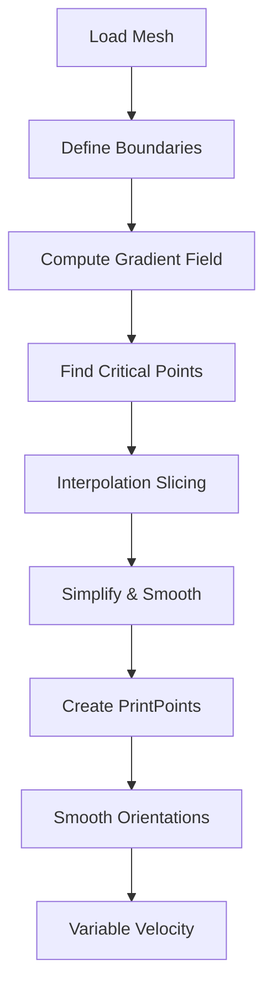

# Curved Slicing (Interpolation)

This example demonstrates non-planar slicing using geodesic interpolation between boundary curves - the signature technique from the ETH research.

## What You'll Learn

- Defining boundary curves for interpolation
- Computing geodesic distance fields
- Finding critical points (minima, maxima, saddles)
- Non-planar slicing with `InterpolationSlicer`
- Variable velocity based on layer height
- Smoothing tool orientations for robotic fabrication

## Why Curved Slicing?

Traditional planar slicing creates horizontal layers. For curved surfaces like shells and domes, this causes:

- Poor surface finish on overhangs
- Weak layer adhesion on steep angles
- Visible stair-stepping

**Curved slicing** generates toolpaths that follow the surface curvature:

```
Planar slicing:          Curved slicing:
    ___________              _________
   |___________|            /         \
   |___________|           /           \
   |___________|          (             )
   |___________|           \           /
   |___________|            \_________/
```

## The Pipeline



## Step-by-Step Walkthrough

### 1. Load Mesh and Boundaries

```python
from pathlib import Path
from compas.datastructures import Mesh
import compas_slicer.utilities as utils
from compas_slicer.pre_processing import create_mesh_boundary_attributes

# Load mesh
mesh = Mesh.from_obj(DATA_PATH / 'mesh.obj')

# Load boundary vertex indices (pre-defined in JSON)
low_boundary_vs = utils.load_from_json(DATA_PATH, 'boundaryLOW.json')
high_boundary_vs = utils.load_from_json(DATA_PATH, 'boundaryHIGH.json')

# Mark boundaries on mesh
create_mesh_boundary_attributes(mesh, low_boundary_vs, high_boundary_vs)
```

!!! info "What are boundaries?"
    Boundaries are the start and end curves for interpolation. For a dome:

    - **LOW boundary**: Base ring (where printing starts)
    - **HIGH boundary**: Top ring (where printing ends)

    The slicer generates contours that smoothly transition between these boundaries.

### 2. Configure Interpolation

```python
from compas_slicer.config import InterpolationConfig

avg_layer_height = 2.0

config = InterpolationConfig(
    avg_layer_height=avg_layer_height,
    # Other options available
)
```

### 3. Create Preprocessor and Gradient Field

```python
from compas_slicer.pre_processing import InterpolationSlicingPreprocessor

preprocessor = InterpolationSlicingPreprocessor(mesh, config, DATA_PATH)

# Create compound targets from boundaries
preprocessor.create_compound_targets()

# Compute gradient field between boundaries
g_eval = preprocessor.create_gradient_evaluation(
    norm_filename='gradient_norm.json',
    g_filename='gradient.json',
    target_1=preprocessor.target_LOW,
    target_2=preprocessor.target_HIGH
)
```

The gradient evaluation computes:

1. **Geodesic distances** from each vertex to both boundaries
2. **Gradient field** showing direction of steepest descent
3. **Gradient magnitude** for identifying critical points

### 4. Find Critical Points

```python
preprocessor.find_critical_points(
    g_eval,
    output_filenames=['minima.json', 'maxima.json', 'saddles.json']
)
```

Critical points are where the gradient is zero:

| Type | Description | Example |
|------|-------------|---------|
| **Minima** | Local low points | Bottom of a valley |
| **Maxima** | Local high points | Top of a bump |
| **Saddles** | Neither min nor max | Mountain pass |

These are important for handling branching geometry (like Y-shaped structures).

### 5. Slice with Interpolation

```python
from compas_slicer.slicers import InterpolationSlicer

slicer = InterpolationSlicer(mesh, preprocessor, config)
slicer.slice_model()
```

The interpolation slicer:

1. Creates a distance field that blends from LOW (0) to HIGH (1)
2. Extracts isocurves at regular intervals
3. Each isocurve becomes one layer (non-planar)

### 6. Simplify and Smooth

```python
from compas_slicer.post_processing import simplify_paths_rdp, seams_smooth

simplify_paths_rdp(slicer, threshold=0.25)
seams_smooth(slicer, smooth_distance=3)
```

### 7. Create PrintPoints

```python
from compas_slicer.print_organization import InterpolationPrintOrganizer

print_organizer = InterpolationPrintOrganizer(slicer, config, DATA_PATH)
print_organizer.create_printpoints()
```

For curved slicing, printpoints include:

- Variable layer heights (thicker on steep areas)
- Surface normals for tool orientation
- Up-vectors for robotic end-effector

### 8. Smooth Tool Orientations

```python
from compas_slicer.print_organization import (
    smooth_printpoints_up_vectors,
    smooth_printpoints_layer_heights,
)

# Smooth up-vectors to avoid jerky robot motion
smooth_printpoints_up_vectors(print_organizer, strength=0.5, iterations=10)

# Smooth layer heights for consistent extrusion
smooth_printpoints_layer_heights(print_organizer, strength=0.5, iterations=5)
```

!!! warning "Why smooth orientations?"
    Raw orientations can change abruptly between points, causing:

    - Jerky robot motion
    - Vibrations in the print
    - Potential collisions

    Smoothing creates gradual transitions while maintaining overall direction.

### 9. Variable Velocity by Layer Height

```python
from compas_slicer.print_organization import set_linear_velocity_by_range

set_linear_velocity_by_range(
    print_organizer,
    param_func=lambda ppt: ppt.layer_height,
    parameter_range=[avg_layer_height * 0.5, avg_layer_height * 2.0],
    velocity_range=[150, 70],  # Fast for thin, slow for thick
    bound_remapping=False
)
```

This sets velocity inversely proportional to layer height:

| Layer Height | Velocity | Reason |
|--------------|----------|--------|
| 1.0 mm (thin) | 150 mm/s | Less material, can go fast |
| 4.0 mm (thick) | 70 mm/s | More material, need time to deposit |

### 10. Safety and Export

```python
from compas_slicer.print_organization import set_extruder_toggle, add_safety_printpoints

set_extruder_toggle(print_organizer, slicer)
add_safety_printpoints(print_organizer, z_hop=10.0)

# Export
printpoints_data = print_organizer.output_printpoints_dict()
utils.save_to_json(printpoints_data, OUTPUT_PATH, 'out_printpoints.json')
```

## Complete Code

```python
--8<-- "examples/2_curved_slicing/ex2_curved_slicing.py"
```

## Running the Example

```bash
cd examples/2_curved_slicing
python ex2_curved_slicing.py
```

With visualization:

```bash
python ex2_curved_slicing.py --visualize
```

## Input Data

The example uses a Y-shaped branching structure:

| File | Description |
|------|-------------|
| `mesh.obj` | Triangulated mesh |
| `boundaryLOW.json` | Vertex indices of lower boundary |
| `boundaryHIGH.json` | Vertex indices of upper boundary |

## Output Files

| File | Description |
|------|-------------|
| `gradient_norm.json` | Gradient magnitude field |
| `gradient.json` | Gradient vector field |
| `minima.json` | Local minimum vertices |
| `maxima.json` | Local maximum vertices |
| `saddles.json` | Saddle point vertices |
| `curved_slicer.json` | Slicer output data |
| `out_printpoints.json` | Final printpoints |

## Mathematical Background

The interpolation is based on geodesic distance fields:

For each vertex $v$:

- $d_{low}(v)$ = geodesic distance to LOW boundary
- $d_{high}(v)$ = geodesic distance to HIGH boundary

The interpolated field at parameter $t \in [0, 1]$:

$$f_t(v) = (1-t) \cdot d_{low}(v) - t \cdot d_{high}(v)$$

The zero-level set of $f_t$ gives one contour. Varying $t$ generates all contours.

## Key Takeaways

1. **Boundaries define the slicing direction**: Choose them carefully
2. **Mesh quality matters**: Use clean, regular triangulation
3. **Critical points handle branching**: Essential for Y-shapes, trees
4. **Smooth everything**: Orientations, heights, velocities
5. **Variable velocity**: Thick layers need slower speeds

## References

This technique is based on research from ETH Zurich:

- Mitropoulou, I., et al. "Nonplanar 3D Printing of Bifurcating Forms" (3D Printing and Additive Manufacturing, 2022)
- Mitropoulou, I., et al. "Print Paths Key-framing" (SCF 2020)

## Next Steps

- [Scalar Field Slicing](05_scalar_field.md) - Custom slicing patterns
- [Slicing Algorithms](../concepts/slicing-algorithms.md) - Theory deep dive
- [Attribute Transfer](06_attributes.md) - Custom per-point data
