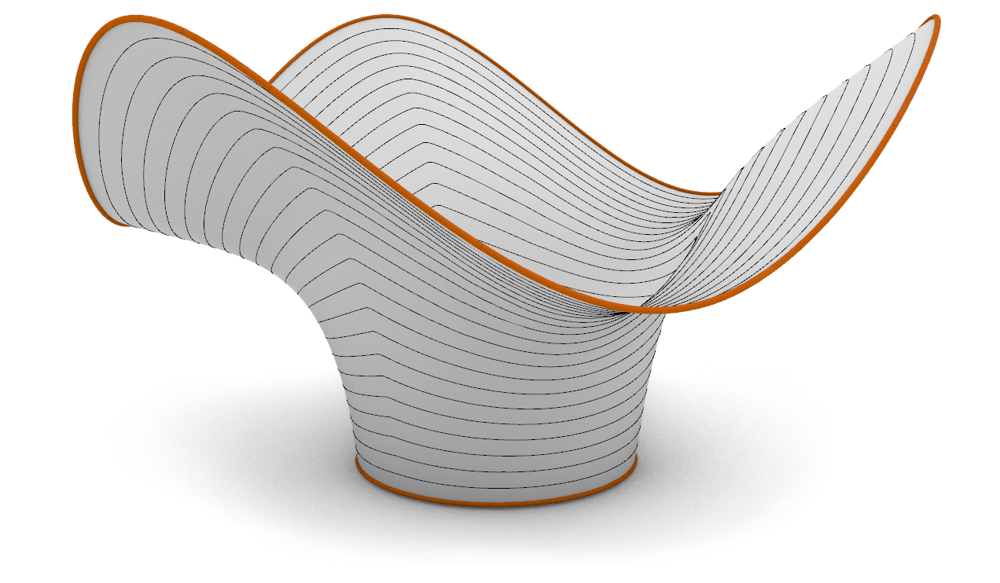
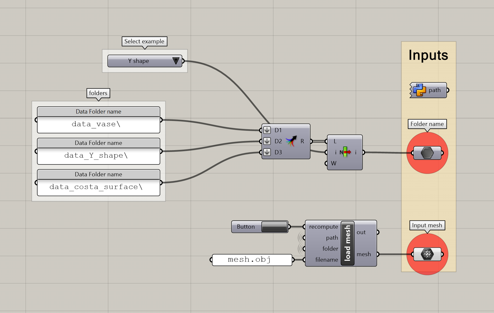
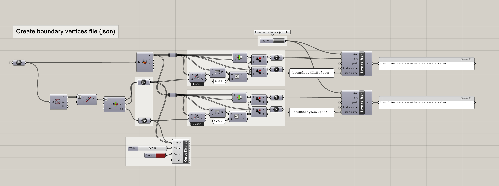

.. _compas_slicer_example_2:

************************************
Interpolation slicing
************************************

A general introduction of the concepts organization of compas_slicer can be found in the :ref:`introduction tutorial <compas_slicer_tutorial_1_introduction>`.

Make sure to read the :ref:`example on simple planar slicing <compas_slicer_example_1>` before reading this example,
as it explains the main concepts of compas_slicer.
Having done that, in this example, we go through the basics of using the non-planar interpolation slicer, which generates
paths by interpolating user-defined boundaries.
This example uses the method described in `Print Paths KeyFraming <https://dl.acm.org/doi/fullHtml/10.1145/3424630.3425408>`_.
Its files can be found in the folder `/examples/2_curved_slicing/`

    *Result of simple curved slicing.*

Note that this example has three different data folders (`/data_costa_surface/`, `/data_vase/`, `/data_Y_shape/`). Feel free
to change the DATA_PATH parameter (in the code block below) to point to any of these folders so that you can slice its contents. To visualize the results,
open the `curved_slicing_master.gh` and select the desired folder in the inputs section (top left). You will only be able to visualize
the results after you have run the python file that generates them.

    *Selection of input folder in Grasshopper (from `curved_slicing_master.gh`).*

Imports and initialization
==========================

.. code-block:: python

    import os
    from compas.datastructures import Mesh
    import logging
    import compas_slicer.utilities as utils
    from compas_slicer.slicers import InterpolationSlicer
    from compas_slicer.post_processing import simplify_paths_rdp
    from compas_slicer.pre_processing import InterpolationSlicingPreprocessor
    from compas_slicer.print_organization import set_extruder_toggle, set_linear_velocity_by_range
    from compas_slicer.print_organization import add_safety_printpoints
    from compas_slicer.pre_processing import create_mesh_boundary_attributes
    from compas_slicer.print_organization import InterpolationPrintOrganizer
    from compas_slicer.post_processing import seams_smooth
    from compas_slicer.print_organization import smooth_printpoints_up_vectors, smooth_printpoints_layer_heights
    import time

    logger = logging.getLogger('logger')
    logging.basicConfig(format='%(levelname)s - %(message)s', level=logging.INFO)

    DATA_PATH = os.path.join(os.path.dirname(__file__), 'data_Y_shape') # set desired folder name
    OUTPUT_PATH = utils.get_output_directory(DATA_PATH)
    OBJ_INPUT_NAME = os.path.join(DATA_PATH, 'mesh.obj')

Slicing process
===============

.. code-block:: python

    # --- Load initial_mesh
    mesh = Mesh.from_obj(os.path.join(DATA_PATH, OBJ_INPUT_NAME))

The interpolation slicer works by interpolating two boundaries provided by the user. Each boundary is represented by a list
of vertex indices, that have been saved in the json files. You can create these json files using the following grasshopper
sequence from the file: `curved_slicing_master.gh`

    *Creation of boundary json files (from `curved_slicing_master.gh`).*

Then the boundary json files are loaded as follows:
.. code-block:: python

    # --- Load targets (boundaries)
    low_boundary_vs = utils.load_from_json(DATA_PATH, 'boundaryLOW.json')
    high_boundary_vs = utils.load_from_json(DATA_PATH, 'boundaryHIGH.json')
    create_mesh_boundary_attributes(mesh, low_boundary_vs, high_boundary_vs)

The slicing process has a number of configuration parameters. Defaults have been specified for all of those parameters.
To see the parameters and their default values, look at ``parameters/defaults_interpolation_slicing.py``. To override
parameters, you can create a parameters dictionary with all the parameters that you want to override. The 'avg_layer_height'
determines how dense the layers will be generated on the surface.

.. code-block:: python

    avg_layer_height = 2.0
    parameters = {
        'avg_layer_height': avg_layer_height,  # controls number of curves that will be generated
    }

The ``InterpolationSlicingPreprocessor`` sets up all the data that are necessary for the interpolation process.

.. code-block:: python

    preprocessor = InterpolationSlicingPreprocessor(mesh, parameters, DATA_PATH)
    preprocessor.create_compound_targets()
    g_eval = preprocessor.create_gradient_evaluation(norm_filename='gradient_norm.json', g_filename='gradient.json',
                                                     target_1=preprocessor.target_LOW,
                                                     target_2=preprocessor.target_HIGH)
    preprocessor.find_critical_points(g_eval, output_filenames=['minima.json', 'maxima.json', 'saddles.json'])

To slice the model by interpolating the boundaries, you can use the ``InterpolationSlicer`` class. The same post-processing
options are available for all slicers.

.. code-block:: python

    # --- slicing
    slicer = InterpolationSlicer(mesh, preprocessor, parameters)
    slicer.slice_model()  # compute_norm_of_gradient contours

    # post processing
    simplify_paths_rdp(slicer, threshold=0.25)
    seams_smooth(slicer, smooth_distance=3)
    slicer.printout_info()
    utils.save_to_json(slicer.to_data(), OUTPUT_PATH, 'curved_slicer.json')

Print organization
====================

The ``PrintOrganizer`` classes generate a list of ``compas_slicer.Printpoint`` instances that have the information
that is necessary for the print process.

.. code-block:: python

    # --- Print organizer
    print_organizer = InterpolationPrintOrganizer(slicer, parameters, DATA_PATH)
    print_organizer.create_printpoints()

    smooth_printpoints_up_vectors(print_organizer, strength=0.5, iterations=10)
    smooth_printpoints_layer_heights(print_organizer, strength=0.5, iterations=5)

    set_linear_velocity_by_range(print_organizer, param_func=lambda ppt: ppt.layer_height,
                                 parameter_range=[avg_layer_height*0.5, avg_layer_height*2.0],
                                 velocity_range=[150, 70], bound_remapping=False)
    set_extruder_toggle(print_organizer, slicer)
    add_safety_printpoints(print_organizer, z_hop=10.0)

Output json file with printpoints.

.. code-block:: python

    # --- Save printpoints dictionary to json file
    printpoints_data = print_organizer.output_printpoints_dict()
    utils.save_to_json(printpoints_data, OUTPUT_PATH, 'out_printpoints.json')

Once the slicing process is finished, you can open the `curved_slicing_master.gh to visualize the results. More information on
this visualization is given in :ref:`grasshopper tutorial <compas_slicer_tutorial_2>`.

Final script
============

The completed final script can be found below:

.. code-block:: python

    import os
    from compas.datastructures import Mesh
    import logging
    import compas_slicer.utilities as utils
    from compas_slicer.slicers import InterpolationSlicer
    from compas_slicer.post_processing import simplify_paths_rdp
    from compas_slicer.pre_processing import InterpolationSlicingPreprocessor
    from compas_slicer.print_organization import set_extruder_toggle, set_linear_velocity_by_range
    from compas_slicer.print_organization import add_safety_printpoints
    from compas_slicer.pre_processing import create_mesh_boundary_attributes
    from compas_slicer.print_organization import InterpolationPrintOrganizer
    from compas_slicer.post_processing import seams_smooth
    from compas_slicer.print_organization import smooth_printpoints_up_vectors, smooth_printpoints_layer_heights
    import time

    logger = logging.getLogger('logger')
    logging.basicConfig(format='%(levelname)s - %(message)s', level=logging.INFO)

    DATA_PATH = os.path.join(os.path.dirname(__file__), 'data_Y_shape')
    OUTPUT_PATH = utils.get_output_directory(DATA_PATH)
    OBJ_INPUT_NAME = os.path.join(DATA_PATH, 'mesh.obj')

    def main():
        start_time = time.time()

        # --- Load initial_mesh
        mesh = Mesh.from_obj(os.path.join(DATA_PATH, OBJ_INPUT_NAME))

        # --- Load targets (boundaries)
        low_boundary_vs = utils.load_from_json(DATA_PATH, 'boundaryLOW.json')
        high_boundary_vs = utils.load_from_json(DATA_PATH, 'boundaryHIGH.json')
        create_mesh_boundary_attributes(mesh, low_boundary_vs, high_boundary_vs)

        avg_layer_height = 2.0

        parameters = {
            'avg_layer_height': avg_layer_height,  # controls number of curves that will be generated
        }

        preprocessor = InterpolationSlicingPreprocessor(mesh, parameters, DATA_PATH)
        preprocessor.create_compound_targets()
        g_eval = preprocessor.create_gradient_evaluation(norm_filename='gradient_norm.json', g_filename='gradient.json',
                                                         target_1=preprocessor.target_LOW,
                                                         target_2=preprocessor.target_HIGH)
        preprocessor.find_critical_points(g_eval, output_filenames=['minima.json', 'maxima.json', 'saddles.json'])

        # --- slicing
        slicer = InterpolationSlicer(mesh, preprocessor, parameters)
        slicer.slice_model()  # compute_norm_of_gradient contours

        simplify_paths_rdp(slicer, threshold=0.25)
        seams_smooth(slicer, smooth_distance=3)
        slicer.printout_info()
        utils.save_to_json(slicer.to_data(), OUTPUT_PATH, 'curved_slicer.json')

        # --- Print organizer
        print_organizer = InterpolationPrintOrganizer(slicer, parameters, DATA_PATH)
        print_organizer.create_printpoints()

        smooth_printpoints_up_vectors(print_organizer, strength=0.5, iterations=10)
        smooth_printpoints_layer_heights(print_organizer, strength=0.5, iterations=5)

        set_linear_velocity_by_range(print_organizer, param_func=lambda ppt: ppt.layer_height,
                                     parameter_range=[avg_layer_height*0.5, avg_layer_height*2.0],
                                     velocity_range=[150, 70], bound_remapping=False)
        set_extruder_toggle(print_organizer, slicer)
        add_safety_printpoints(print_organizer, z_hop=10.0)

        # --- Save printpoints dictionary to json file
        printpoints_data = print_organizer.output_printpoints_dict()
        utils.save_to_json(printpoints_data, OUTPUT_PATH, 'out_printpoints.json')

        end_time = time.time()
        print("Total elapsed time", round(end_time - start_time, 2), "seconds")

    if __name__ == "__main__":
        main()
