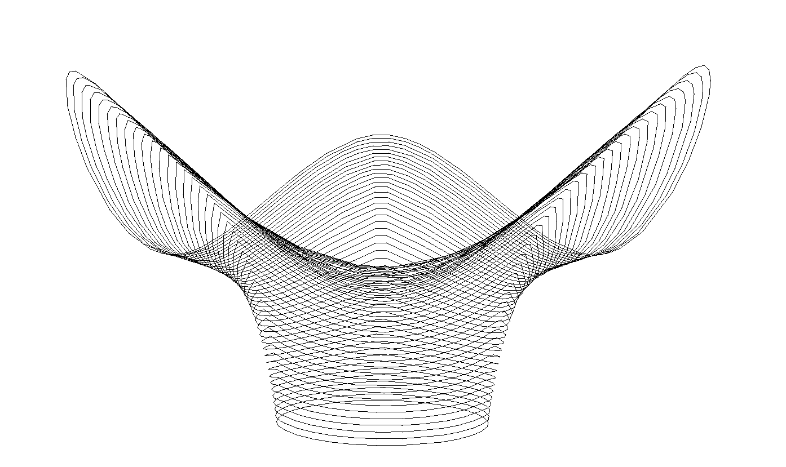

*********************
Simple curved slicing
*********************

    *Result of simple curved slicing.*

.. code-block:: python

    import os
    from compas.datastructures import Mesh
    import logging
    import compas_slicer.utilities as utils
    from compas_slicer.slicers import CurvedSlicer
    from compas_slicer.post_processing import simplify_paths_rdp
    from compas_slicer.pre_processing import CurvedSlicingPreprocessor
    from compas_slicer.pre_processing import create_mesh_boundary_attributes
    from compas_slicer.print_organization import CurvedPrintOrganizer
    from compas_viewers.objectviewer import ObjectViewer
    import time

    logger = logging.getLogger('logger')
    logging.basicConfig(format='%(levelname)s - %(message)s', level=logging.INFO)

    DATA_PATH = os.path.join(os.path.dirname(__file__), 'data_basic_example')
    OUTPUT_PATH = utils.get_output_directory(DATA_PATH)
    OBJ_INPUT_NAME = os.path.join(DATA_PATH, 'vase.obj')

    def main():
        start_time = time.time()

        ### --- Load initial_mesh
        mesh = Mesh.from_obj(os.path.join(DATA_PATH, OBJ_INPUT_NAME))

        ### --- Load targets (boundaries)
        low_boundary_vs = utils.load_from_json(DATA_PATH, 'boundaryLOW.json')
        high_boundary_vs = utils.load_from_json(DATA_PATH, 'boundaryHIGH.json')
        create_mesh_boundary_attributes(mesh, low_boundary_vs, high_boundary_vs)

        parameters = {
            'avg_layer_height': 5.0,  # controls number of curves that will be generated
            'min_layer_height': 0.1,
            'max_layer_height': 50.0,  # 2.0,
            'layer_heights_smoothing': [False, 5, 0.2],  # boolean, iterations, strength
            'up_vectors_smoothing': [True, 5, 0.2]  # boolean, iterations, strength
        }

        preprocessor = CurvedSlicingPreprocessor(mesh, parameters, DATA_PATH)
        preprocessor.create_compound_targets()
        preprocessor.gradient_evaluation(norm_filename='gradient_norm.json',  g_filename='gradient.json',
                                         target_1=preprocessor.target_LOW, target_2=preprocessor.target_HIGH)
        preprocessor.find_critical_points(output_filenames=['minima.json', 'maxima.json', 'saddles.json'])

        ## --- slicing
        slicer = CurvedSlicer(mesh, preprocessor, parameters)
        slicer.slice_model()  # compute_norm_of_gradient contours

        simplify_paths_rdp(slicer, threshold=1.0)
        slicer.printout_info()
        utils.save_to_json(slicer.to_data(), OUTPUT_PATH, 'curved_slicer.json')

        # ### --- Print organizer
        print_organizer = CurvedPrintOrganizer(slicer, parameters, DATA_PATH)
        print_organizer.create_printpoints()

        ### --- Save printpoints dictionary to json file
        printpoints_data = print_organizer.output_printpoints_dict()
        utils.save_to_json(printpoints_data, OUTPUT_PATH, 'out_printpoints.json')

        ### ----- Visualize
        viewer = ObjectViewer()
        slicer.visualize_on_viewer(viewer, visualize_mesh=False, visualize_paths=True)
        # print_organizer.visualize_on_viewer(viewer, visualize_polyline=True, visualize_printpoints=False)
        viewer.update()
        viewer.show()

        end_time = time.time()
        print("Total elapsed time", round(end_time - start_time, 2), "seconds")

    if __name__ == "__main__":
        main()
