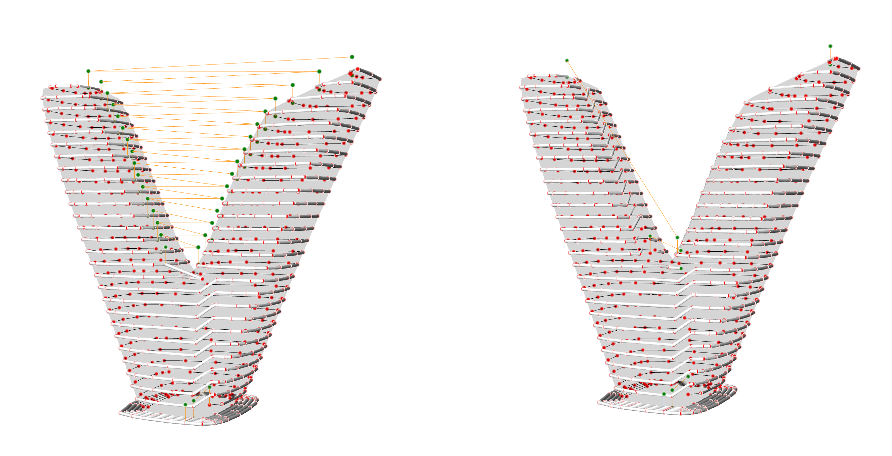

# Vertical Layer Sorting

This example demonstrates how to handle models with multiple disconnected regions at the same height - like V-shapes, trees, or branching structures.



## What You'll Learn

- Sorting paths into vertical layers (disconnected regions)
- Reordering vertical layers for optimal printing
- Setting blend radius for smooth robotic motion

## The Problem

When slicing a V-shaped or branching model, a single horizontal slice may intersect multiple disconnected regions:

```
     Layer 5:    ●          ●    (two separate contours)
     Layer 4:    ●          ●
     Layer 3:     ●        ●
     Layer 2:      ●      ●
     Layer 1:       ●    ●
     Layer 0:        ●●●●        (one contour at base)
```

Without vertical sorting, the printer jumps between left and right branches randomly. With vertical sorting, each branch is printed completely before moving to the next.

## The Solution


## Step-by-Step Walkthrough

### 1. Standard Planar Slicing

```python
from compas.datastructures import Mesh
from compas.geometry import Point
from compas_slicer.slicers import PlanarSlicer
from compas_slicer.pre_processing import move_mesh_to_point

mesh = Mesh.from_obj(DATA_PATH / 'distorted_v_closed_mid_res.obj')
move_mesh_to_point(mesh, Point(0, 0, 0))

slicer = PlanarSlicer(mesh, layer_height=5.0)
slicer.slice_model()
```

### 2. Sort into Vertical Layers

```python
from compas_slicer.post_processing import sort_into_vertical_layers

sort_into_vertical_layers(
    slicer,
    dist_threshold=25.0,    # Max distance to group paths together
    max_paths_per_layer=25  # Max paths per vertical layer
)
```

This groups paths into "vertical layers" - continuous vertical columns that can be printed without jumping.

**Parameters:**

| Parameter | Description |
|-----------|-------------|
| `dist_threshold` | Maximum XY distance between paths to be in same vertical layer |
| `max_paths_per_layer` | Limit on paths per vertical layer (prevents huge groups) |

### 3. Reorder Vertical Layers

```python
from compas_slicer.post_processing import reorder_vertical_layers

reorder_vertical_layers(slicer, align_with="x_axis")
```

Orders the vertical layers for optimal printing sequence. Options:

| Mode | Description |
|------|-------------|
| `"x_axis"` | Left to right |
| `"y_axis"` | Front to back |
| `"centroids"` | By centroid position |

### 4. Standard Post-Processing

```python
from compas_slicer.post_processing import generate_brim, simplify_paths_rdp, seams_smooth

generate_brim(slicer, layer_width=3.0, number_of_brim_offsets=5)
simplify_paths_rdp(slicer, threshold=0.7)
seams_smooth(slicer, smooth_distance=10)
```

### 5. Print Organization with Blend Radius

```python
from compas_slicer.print_organization import (
    PlanarPrintOrganizer,
    set_extruder_toggle,
    add_safety_printpoints,
    set_linear_velocity_constant,
    set_blend_radius,
)

print_organizer = PlanarPrintOrganizer(slicer)
print_organizer.create_printpoints()

set_extruder_toggle(print_organizer, slicer)
add_safety_printpoints(print_organizer, z_hop=10.0)
set_linear_velocity_constant(print_organizer, v=25.0)

# Blend radius for smooth robot motion
set_blend_radius(print_organizer, d_fillet=10.0)
```

!!! info "What is blend radius?"
    Blend radius (or fillet) smooths sharp corners in the robot path. Instead of stopping at each point, the robot blends through with a curved motion.

    - `d_fillet=0`: Stop at each point (precise but slow)
    - `d_fillet=10`: 10mm blend radius (smooth and fast)

## Complete Code

```python
--8<-- "examples/3_planar_slicing_vertical_sorting/example_3_planar_vertical_sorting.py"
```

## Running the Example

```bash
cd examples/3_planar_slicing_vertical_sorting
python example_3_planar_vertical_sorting.py --visualize
```

## When to Use Vertical Sorting

Use vertical sorting when your model has:

- **Branching geometry**: Y-shapes, trees, coral-like structures
- **Multiple parts**: Several objects on one build plate
- **Islands**: Disconnected regions at the same height

## Key Takeaways

1. **Vertical sorting groups continuous regions**: Print one branch completely before moving to the next
2. **Reordering optimizes travel**: Choose sensible order to minimize jumps
3. **Blend radius matters for robots**: Smooth motion reduces wear and improves quality

## Next Steps

- [G-code Generation](04_gcode.md) - Export for desktop printers
- [Curved Slicing](02_curved_slicing.md) - Non-planar approach for branching
