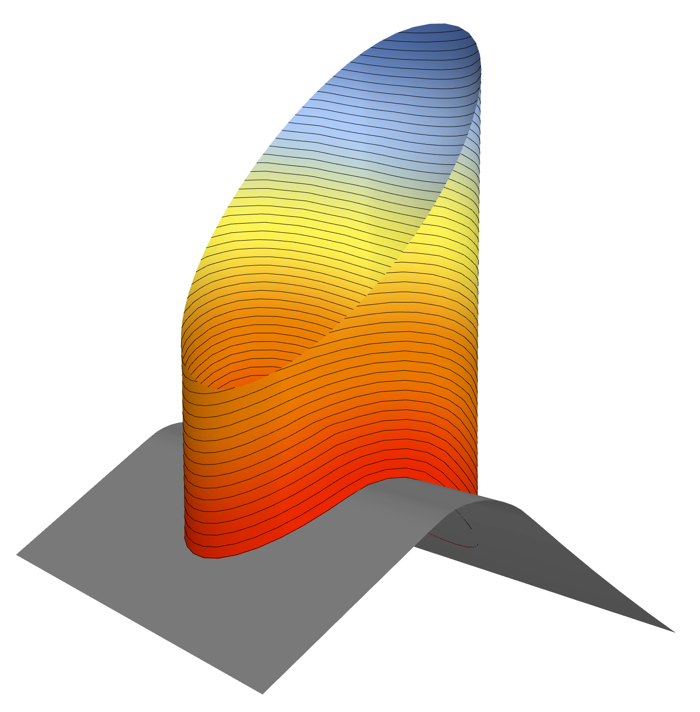

.. _compas_slicer_example_5:

************************************
Non-planar slicing on custom base
************************************

In this example we describe the process of non-planar slicing of a mesh, generating paths that are an offset to its
custom base. We are using the ScalarFieldSlicer, which generates paths as contours of a scalar field defined on every
vertex of the mesh. In this case we create a scalar field with the distance of each vertex from the custom base.

    *Result of scalar field slicing considering the distance of each vertex from the custom base.*

.. code-block:: python

    import logging
    from compas.geometry import distance_point_point
    from compas.datastructures import Mesh
    import os
    import compas_slicer.utilities as slicer_utils
    from compas_slicer.post_processing import simplify_paths_rdp
    from compas_slicer.slicers import ScalarFieldSlicer
    import compas_slicer.utilities as utils
    from compas_slicer.print_organization import ScalarFieldPrintOrganizer

    logger = logging.getLogger('logger')
    logging.basicConfig(format='%(levelname)s-%(message)s', level=logging.INFO)

    DATA_PATH = os.path.join(os.path.dirname(__file__), 'data')
    OUTPUT_PATH = slicer_utils.get_output_directory(DATA_PATH)
    MODEL = 'geom_to_slice.obj'
    BASE = 'custom_base.obj'

    if __name__ == '__main__':

        # --- load meshes
        mesh = Mesh.from_obj(os.path.join(DATA_PATH, MODEL))
        base = Mesh.from_obj(os.path.join(DATA_PATH, BASE))

        # --- Create per-vertex scalar field (distance of every vertex from the custom base)
        pts = [mesh.vertex_coordinates(v_key, axes='xyz') for v_key in
               mesh.vertices()]  # list of the vertex coordinates of the mesh as compas.geometry.Point instances
        _, projected_pts = utils.pull_pts_to_mesh_faces(base, pts)  # list with projections of all mesh vertices on the mesh
        u = [distance_point_point(pt, proj_pt) for pt, proj_pt in
             zip(pts, projected_pts)]  # list with distance between initial+projected pts (one per vertex)
        utils.save_to_json(u, OUTPUT_PATH, 'distance_field.json')  # save distance field to json for visualization

        # --- assign the scalar field to the mesh's attributes, under the name 'scalar_field'
        mesh.update_default_vertex_attributes({'scalar_field': 0.0})
        for i, (v_key, data) in enumerate(mesh.vertices(data=True)):
            data['scalar_field'] = u[i]

        # --- Slice model by generating contours of scalar field
        slicer = ScalarFieldSlicer(mesh, u, no_of_isocurves=50)
        slicer.slice_model()
        # simplify_paths_rdp(slicer, threshold=0.3)
        slicer_utils.save_to_json(slicer.to_data(), OUTPUT_PATH, 'isocontours.json')  # save results to json

        # --- Print organization calculations (i.e. generation of printpoints with fabrication-related information)
        simplify_paths_rdp(slicer, threshold=0.3)
        print_organizer = ScalarFieldPrintOrganizer(slicer, parameters={}, DATA_PATH=DATA_PATH)
        print_organizer.create_printpoints()

        print_organizer.printout_info()
        printpoints_data = print_organizer.output_printpoints_dict()
        utils.save_to_json(printpoints_data, OUTPUT_PATH, 'out_printpoints.json')  # save results to json
