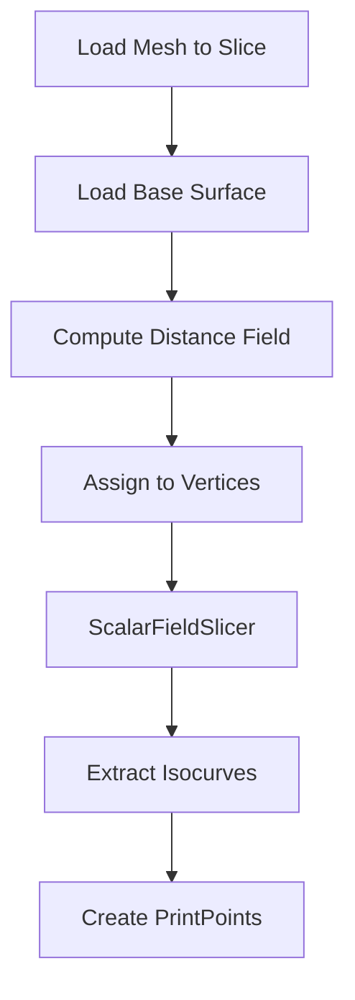

# Scalar Field Slicing

This example demonstrates non-planar slicing using a custom scalar field - enabling you to print along arbitrary surfaces rather than horizontal planes.

## What You'll Learn

- Creating a scalar field from geometric distance
- Assigning scalar values to mesh vertices
- Slicing with `ScalarFieldSlicer`
- Printing on top of existing geometry

## Why Scalar Field Slicing?

Traditional planar slicing creates horizontal layers. But what if you want to:

- **Print on a curved base**: Add features on top of an existing surface
- **Follow terrain**: Print conformal layers over a landscape
- **Custom layer patterns**: Define exactly where each layer goes

Scalar field slicing generates isocurves (contours) from any per-vertex scalar field, not just Z-height.

```
Planar slicing:              Scalar field slicing:
     _____                        _____
    |_____|  Z=3                 /     \  u=3
    |_____|  Z=2                /       \ u=2
    |_____|  Z=1               (         ) u=1
    |_____|  Z=0                \_______/  u=0 (base surface)
```

## The Pipeline



## Step-by-Step Walkthrough

### 1. Load Meshes

We need two meshes:

- **Mesh to slice**: The geometry you want to print
- **Base surface**: The surface to print on top of

```python
from pathlib import Path
from compas.datastructures import Mesh

mesh = Mesh.from_obj(DATA_PATH / 'geom_to_slice.obj')  # Geometry to slice
base = Mesh.from_obj(DATA_PATH / 'custom_base.obj')    # Base surface
```

### 2. Compute Distance Field

For each vertex of the mesh, compute its distance to the base surface:

```python
from compas.geometry import distance_point_point
import compas_slicer.utilities as utils

# Get all vertex coordinates
pts = [mesh.vertex_coordinates(v_key, axes='xyz') for v_key in mesh.vertices()]

# Project points onto base surface
_, projected_pts = utils.pull_pts_to_mesh_faces(base, pts)

# Compute distance from each point to its projection
u = [distance_point_point(pt, proj_pt) for pt, proj_pt in zip(pts, projected_pts)]
```

This creates a scalar field `u` where:

- `u = 0` at points on the base surface
- `u > 0` at points above the base
- The value increases with distance from the base

### 3. Assign Scalar Field to Mesh

Store the scalar values as vertex attributes:

```python
mesh.update_default_vertex_attributes({'scalar_field': 0.0})

for i, (v_key, data) in enumerate(mesh.vertices(data=True)):
    data['scalar_field'] = u[i]
```

### 4. Slice with Scalar Field

```python
from compas_slicer.slicers import ScalarFieldSlicer

slicer = ScalarFieldSlicer(mesh, u, no_of_isocurves=50)
slicer.slice_model()
```

The slicer:

1. Sorts vertices by scalar value
2. Determines the range `[u_min, u_max]`
3. Creates `no_of_isocurves` evenly spaced threshold values
4. Extracts the zero-crossing contour for each threshold

**Parameters:**

| Parameter | Description |
|-----------|-------------|
| `mesh` | The mesh to slice |
| `u` | List of scalar values (one per vertex) |
| `no_of_isocurves` | Number of contours to extract |

### 5. Simplify and Create PrintPoints

```python
from compas_slicer.post_processing import simplify_paths_rdp
from compas_slicer.print_organization import ScalarFieldPrintOrganizer

simplify_paths_rdp(slicer, threshold=0.3)

print_organizer = ScalarFieldPrintOrganizer(slicer, DATA_PATH=DATA_PATH)
print_organizer.create_printpoints()
```

### 6. Export Results

```python
printpoints_data = print_organizer.output_printpoints_dict()
utils.save_to_json(printpoints_data, OUTPUT_PATH, 'out_printpoints.json')
```

## How It Works

### Isocurve Extraction

An isocurve is a contour where the scalar field equals a specific value. For a threshold $t$:

$$\text{isocurve}_t = \{p \in \text{mesh} : u(p) = t\}$$

The algorithm finds edges where the scalar field crosses the threshold:

```
Vertex A (u=2.3)
    ●
     \        Threshold t=2.0
      \       Isocurve crosses here!
       ●
Vertex B (u=1.7)
```

The crossing point is found by linear interpolation:

$$p = A + \frac{t - u_A}{u_B - u_A}(B - A)$$

### Choosing Number of Isocurves

The number of isocurves determines layer height:

$$\text{avg layer height} \approx \frac{u_{max} - u_{min}}{\text{no\_of\_isocurves}}$$

More isocurves = thinner layers = smoother surface but longer print time.

## Custom Scalar Fields

You can use any scalar field, not just distance:

### Height-Based Field

```python
u = [mesh.vertex_coordinates(v)[2] for v in mesh.vertices()]
```

This is equivalent to planar slicing.

### Radial Field

```python
from compas.geometry import Point, distance_point_point

center = Point(0, 0, 0)
u = [distance_point_point(mesh.vertex_coordinates(v), center)
     for v in mesh.vertices()]
```

Creates concentric circular layers (spiral vase mode).

### Geodesic Field

```python
# Using CGAL for geodesic distance from boundary vertices
from compas_cgal.geodesics import heat_geodesic_distances
distances = heat_geodesic_distances((V, F), boundary_vertices)
```

Creates layers that follow surface curvature.

## Complete Code

```python
--8<-- "examples/5_non_planar_slicing_on_custom_base/scalar_field_slicing.py"
```

## Running the Example

```bash
cd examples/5_non_planar_slicing_on_custom_base
python scalar_field_slicing.py
```

With visualization:

```bash
python scalar_field_slicing.py --visualize
```

## Output Files

| File | Description |
|------|-------------|
| `distance_field.json` | Scalar values for visualization |
| `isocontours.json` | Slicer output data |
| `out_printpoints.json` | Final printpoints |

## Use Cases

### Printing on Curved Surfaces

Print text or patterns on top of a curved object:

1. Load the base object
2. Create the feature geometry offset above the surface
3. Use distance-to-surface as scalar field
4. Layers conform to the base curvature

### Conformal Printing

Print a thin shell that follows terrain:

1. Load terrain mesh as base
2. Create offset shell above terrain
3. Scalar field = distance from terrain
4. Each layer follows the terrain contours

### Variable Layer Height

Combine with other slicing methods:

1. Planar slice the main body
2. Scalar field slice the curved top
3. Merge the toolpaths

## Key Takeaways

1. **Scalar field defines layers**: Any per-vertex value can drive slicing
2. **Distance field is common**: Distance from base surface creates conformal layers
3. **Isocurves are contours**: Zero-crossings at each threshold value
4. **Number of curves = resolution**: More isocurves = finer layers

## Next Steps

- [Attribute Transfer](06_attributes.md) - Transfer mesh properties to toolpaths
- [Slicing Algorithms](../concepts/slicing-algorithms.md) - Deep dive into theory
- [Curved Slicing](02_curved_slicing.md) - Geodesic interpolation approach
