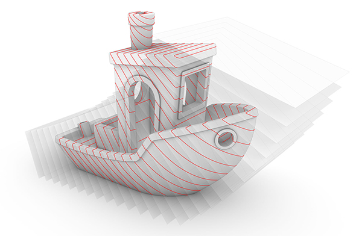

********************************************************************************
Overview
********************************************************************************

.. rst-class:: lead

   **COMPAS_SLICER is a slicing package for FDM 3D Printing using COMPAS.** 
   Currently, COMPAS_SLICER only supports Robotic FDM 3D Printing processes, 
   but this will be extended in the future. The package builds upon 
   `COMPAS <https://compas.dev/>`_, an open-source Python-based framework for 
   collaboration and research in architecture, engineering and digital fabrication.

.. note::

    COMPAS_SLICER is still in a very early, pre-release state and therefore could 
    contain bugs. In case you find bugs or would like to request additional 
    functionality, please submit an issue using the 
    `Issue Tracker <https://github.com/dbt-ethz/compas_slicer/issues>`_.

Table of Contents
=================

.. toctree::
   :maxdepth: 3
   :titlesonly:

   Overview <self>
   installation
   tutorials
   examples
   api
   devguide
   license
   citing
