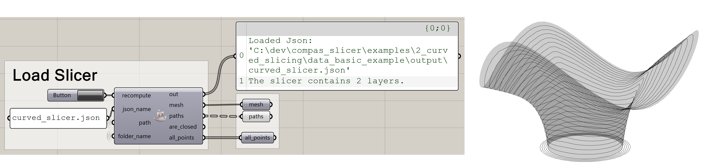
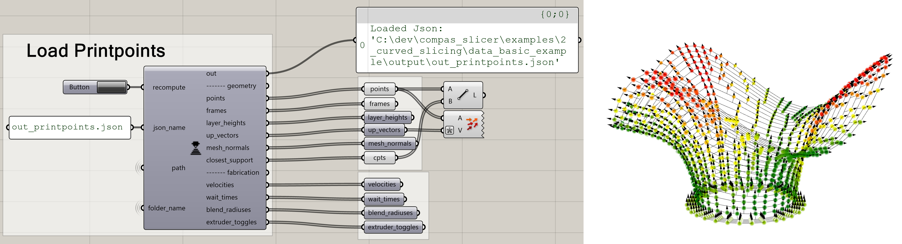
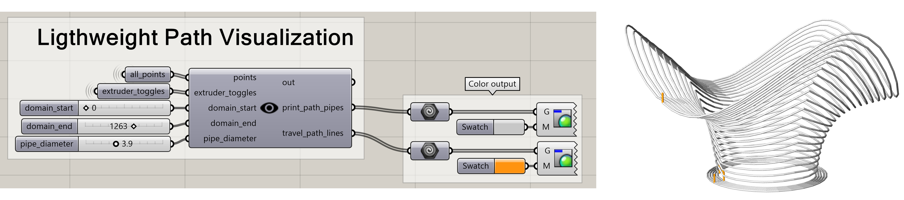
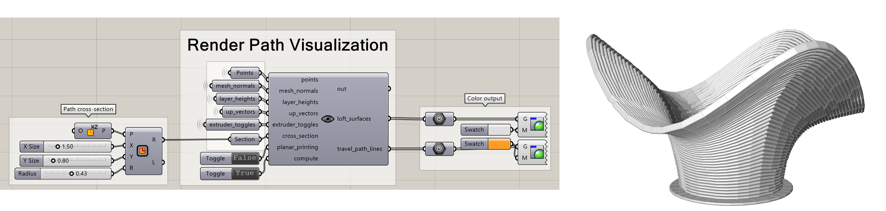

.. _compas_slicer_tutorial_2:

****************************
Visualization in grasshopper
****************************

This tutorial gives an overview of how the results of the slicing process can be visualized in Rhino grasshopper.
It is important to note that the grasshopper components do not run any slicing code, they merely visualize
existing results, that have been generated using python.

Installation
===============
To install the grasshopper components see the :ref:`installation page <compas_slicer_installation>`.

Overview
=========

When compas_slicer code is run for a project `my_project`, then the folder `my_project/data/output/` is created, where
all the intermediary and final results of the slicing process are saved in the form of json files. The grasshopper
components look into that folder, load the according json file, and turn it into geometry that can be visualized.
To find the correct folder, the grasshopper file that contains the components needs to be positioned in the `my_project`
folder. You can look at the `compas_slicer/examples` to see the way the grasshopper components are used.

Workflow
==========

When the compas_slicer python code is run, then all the json files that are recalculated are overwritten in the output
folder. To update the visualization in grasshopper we click on the button `recompute` that is on the top of each component.
This loads the latest version of the according json file from the output folder.

Components
============
The components that exist correspond to the main classes of data types from compas_slicer that someone might want to
visualize. The following components are currently available.

* csLoadSlicer

Loads the `compas_slicer.slicers.Base_slicer` class and all classes that inherit from it, with all the attributes stored
in the class.

    *Loading the slicer results.*

* csLoadPrintpoints

Loads the Printpoints dictionary with all the data stored in the `compas_slicer.geometry.PrintPoint` class.

    *Loading the outputted printpoints information.*

* csLightPathViz

Creates a lightweight visualization of the paths. The print paths are displayed with white tubes, and the traveling paths
are displayed with orange tubes.

    *Lightweight paths visualization.*

* csRenderPathViz

If the user provides a cross-section of the paths, then a more expensive visualization can be created, where each path
is displayed with its cross-sectional geometry.

    *Render paths visualization.*

And many others that will be documented soon!...

