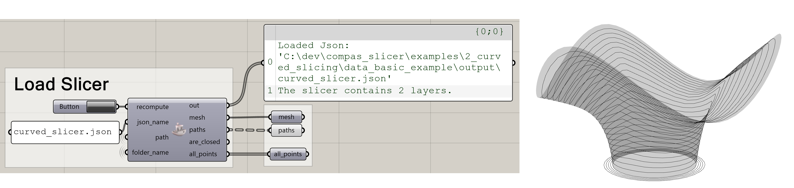
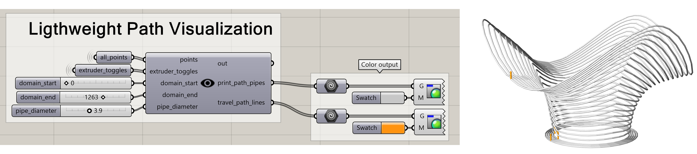
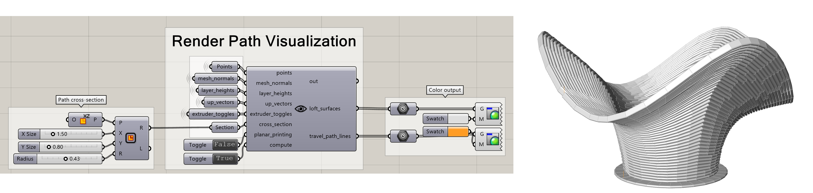

# Grasshopper Visualization

This tutorial explains how to visualize COMPAS Slicer results in Rhino/Grasshopper.

!!! info "Important"
    The Grasshopper components **only visualize** existing results. All slicing computation happens in Python - the components load and display the JSON output files.

## Setup

1. Install COMPAS Slicer (see [Installation](../installation.md))
2. Install Grasshopper components:

    ```bash
    python -m compas_rhino.install -v 8.0
    ```

## Workflow


1. Run your Python slicing script
2. Output files are saved to `project/data/output/`
3. Open the Grasshopper file in `project/`
4. Click **Recompute** on components to load latest results

## Project Structure

```
my_project/
├── data/
│   ├── model.obj           # Input mesh
│   └── output/
│       ├── slicer_data.json
│       └── out_printpoints.json
├── my_script.py            # Python slicing code
└── visualization.gh        # Grasshopper file
```

!!! tip
    Place your `.gh` file in the project root folder so components can find the `data/output/` folder.

## Components

### csLoadSlicer

Loads slicer results from JSON, including all layer and path data.



**Outputs:**

- Layers (list of paths per layer)
- Path geometry (polylines)
- Layer heights

---

### csLoadPrintpoints

Loads the printpoints dictionary with all fabrication parameters.


**Outputs:**

- Point locations
- Velocities
- Extruder states
- Up vectors

---

### csLightPathViz

Creates a lightweight visualization of toolpaths.



- **White tubes**: Print paths
- **Orange tubes**: Travel moves

---

### csRenderPathViz

Creates a detailed visualization with actual path cross-sections.



Requires a cross-section curve as input for accurate representation.

## Example Workflow

1. **Run Python script:**

    ```python
    from compas_slicer.slicers import PlanarSlicer
    from compas_slicer.utilities import save_to_json

    slicer = PlanarSlicer(mesh, layer_height=2.0)
    slicer.slice_model()
    save_to_json(slicer.to_data(), OUTPUT_PATH, 'slicer_data.json')
    ```

2. **In Grasshopper:**
    - Add `csLoadSlicer` component
    - Connect to visualization components
    - Click Recompute after each Python run
