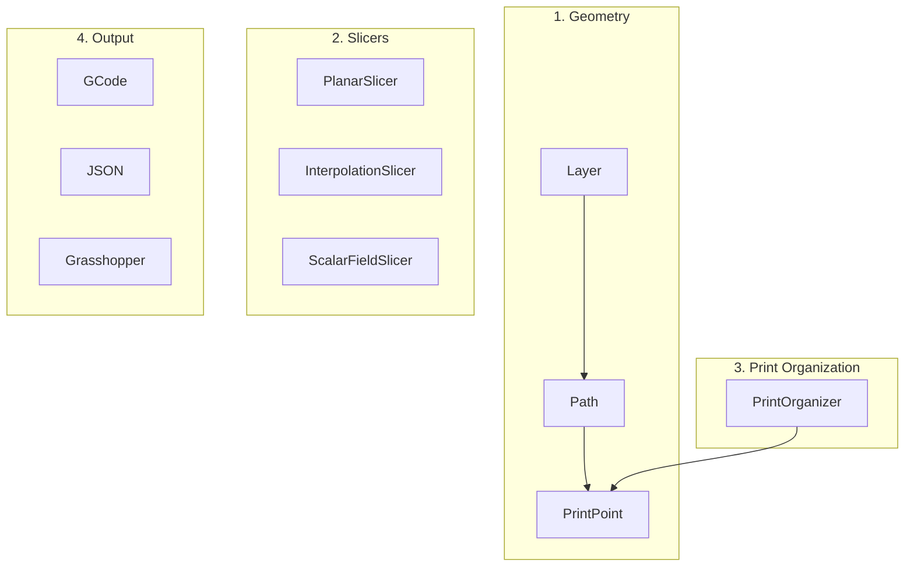

# Introduction

This tutorial introduces the core concepts and architecture of COMPAS Slicer.

## Overview

COMPAS Slicer is organized into four main components:



| Component | Purpose |
|-----------|---------|
| **Geometry** | Core geometric entities: `Layer`, `Path`, `PrintPoint` |
| **Slicers** | Generate sliced paths from meshes |
| **Print Organizers** | Embed fabrication parameters into paths |
| **Visualization** | Display results in Rhino/Grasshopper |

## Geometry

### Layer

A `Layer` represents a single slice of the model. In planar slicing, all points in a layer are at the same Z height. In non-planar slicing, points can vary in height.


### VerticalLayer

A `VerticalLayer` groups multiple layers together - useful for models with branching geometry.


### Path

A `Path` is a closed or open contour containing a list of points. A layer can contain multiple paths (e.g., for models with holes or branches).

### PrintPoint

A `PrintPoint` extends a geometric point with fabrication parameters:

- Velocity
- Extrusion rate
- Layer height
- Up vector (tool orientation)
- Extruder toggle (on/off)

## Slicers

| Slicer | Description | Use Case |
|--------|-------------|----------|
| `PlanarSlicer` | Intersects mesh with horizontal planes | Standard FDM printing |
| `InterpolationSlicer` | Interpolates between boundary curves | Non-planar surfaces, shells |
| `ScalarFieldSlicer` | Follows scalar field contours | Custom layer patterns |

## Print Organizers

After slicing, print organizers convert geometric points to `PrintPoints` with fabrication data:

```python
from compas_slicer.print_organization import PlanarPrintOrganizer

organizer = PlanarPrintOrganizer(slicer)
organizer.create_printpoints()

# Add fabrication parameters
set_linear_velocity_constant(organizer, velocity=25)
set_extruder_toggle(organizer, slicer)
add_safety_printpoints(organizer, z_hop=5.0)
```

## Package Structure

```
compas_slicer/
├── geometry/          # Layer, Path, PrintPoint
├── slicers/           # PlanarSlicer, InterpolationSlicer, etc.
├── print_organization/# PrintOrganizers and utilities
├── pre_processing/    # Mesh preparation (positioning, boundaries)
├── post_processing/   # Path modifications (brim, raft, sorting)
├── utilities/         # Helper functions
└── visualization/     # Viewer utilities
```

## Next Steps

- [Grasshopper Visualization](grasshopper.md) - Visualize results in Rhino
- [Examples](../examples/index.md) - Complete working examples
